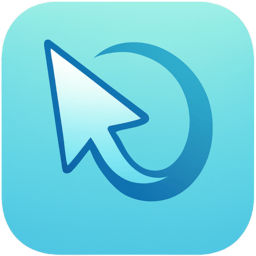

# BuenMouse Landing Page

<div align="center">
  
  
  **Landing page for BuenMouse** - A productivity app for macOS that enhances your mouse and trackpad experience.

[🌐 Live Site](https://mouse.stevenacz.com) · [📦 Main App](https://github.com/StevenACZ/BuenMouse)

</div>

---

## ✨ Features

- 🌍 **Internationalization** - Full English and Spanish support
- 🔍 **SEO Optimized** - Schema.org, Open Graph, Twitter Cards, Sitemap
- 📱 **PWA Ready** - Installable with manifest.json
- ⚡ **Fast** - Built with Astro for optimal performance
- 🎨 **Modern Design** - Dark theme with glassmorphism effects

## 🛠️ Tech Stack

- **Framework**: [Astro](https://astro.build)
- **Styling**: Vanilla CSS with CSS Variables
- **i18n**: Custom implementation
- **SEO**: @astrojs/sitemap, Schema.org JSON-LD

## 🚀 Quick Start

```bash
# Install dependencies
npm install

# Start development server
npm run dev

# Build for production
npm run build

# Preview production build
npm run preview
```

## 📂 Project Structure

```
src/
├── components/     # Astro components (Hero, Features, etc.)
├── i18n/           # Internationalization (translations)
├── layouts/        # Page layouts
├── pages/          # Routes ([lang]/index.astro)
└── styles/         # Global CSS

public/
├── icons/          # App icons (various sizes)
├── og-image.jpg    # Social sharing image
├── manifest.json   # PWA manifest
└── robots.txt      # Search engine directives
```

## 🌐 Deployment

The site is deployed to `https://mouse.stevenacz.com`

### Sitemap URL

```
https://mouse.stevenacz.com/sitemap-index.xml
```

## 📄 License

MIT © [Steven Coaila Zaa](https://github.com/StevenACZ)
